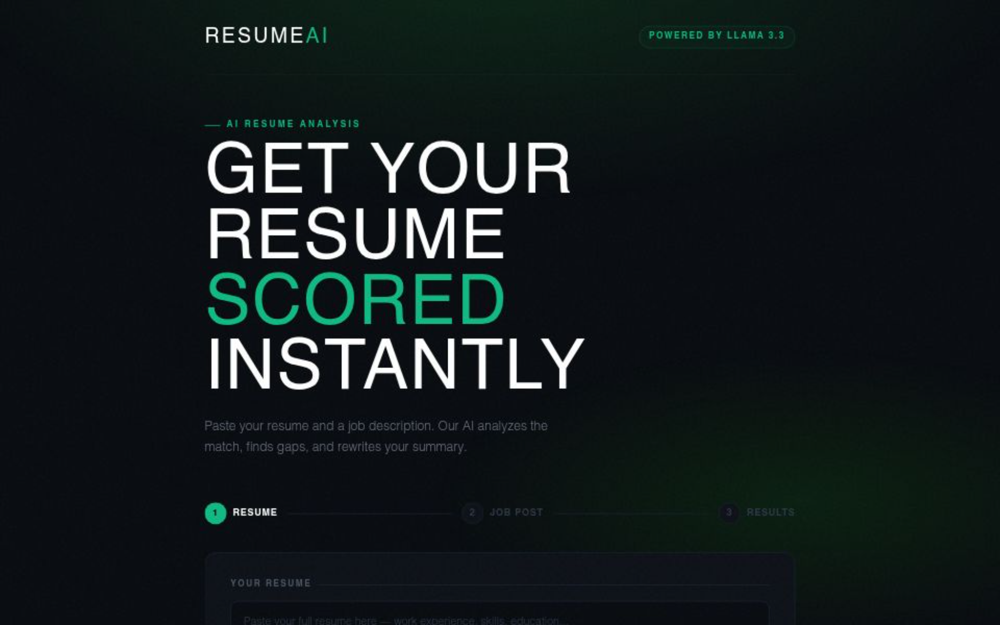

# AI Resume Analyzer 🤖

A full stack AI SaaS app that analyzes your resume against a job description and returns an instant match score, skill gap analysis, keyword matching, and an AI-rewritten professional summary.

🔗 **Live Demo:** [my-resume-ai-rishicodes-7s-projects.vercel.app](https://my-resume-ai-omega.vercel.app/)

---

## Preview



---

## Features

- **Match Score** — AI scores your resume from 0–100 against the job
- **Strengths Analysis** — highlights what you're doing right
- **Gap Analysis** — shows exactly what's missing from your resume
- **Keyword Matching** — matched vs missing keywords at a glance
- **AI Rewritten Summary** — tailored professional summary for the role
- **Copy to Clipboard** — one click to copy the rewritten summary
- **Fully Responsive** — works on mobile, tablet, and desktop
- **Fast** — powered by Groq's ultra-fast LLaMA 3.3 inference

---

## Tech Stack

| Layer | Tech |
|---|---|
| Framework | Next.js 16 (App Router) |
| Styling | Tailwind CSS |
| AI Model | LLaMA 3.3 70B via Groq API |
| Deployment | Vercel |
| Language | JavaScript |

---

## Getting Started

### 1. Clone the repo
```bash
git clone https://github.com/rishicodes-7/my-resume-ai
cd my-resume-ai
```

### 2. Install dependencies
```bash
npm install
```

### 3. Set up environment variables

Create a `.env.local` file in the root:
```
GROQ_API_KEY=your_groq_api_key_here
```

Get your free Groq API key at [console.groq.com](https://console.groq.com)

### 4. Run locally
```bash
npm run dev
```

Open [http://localhost:3000](http://localhost:3000) in your browser.

---

## How It Works

1. User pastes their **resume text**
2. User pastes the **job description**
3. App sends both to the Groq API with a structured prompt
4. LLaMA 3.3 returns a JSON response with score, strengths, gaps, keywords, and rewritten summary
5. Results are displayed in a clean tabbed UI

```
User Input → Next.js API Route → Groq API (LLaMA 3.3) → JSON Response → UI
```

---

## Project Structure

```
my-resume-ai/
├── app/
│   ├── page.js          ← Main UI
│   ├── layout.js        ← Root layout
│   └── api/
│       └── analyze/
│           └── route.js ← AI API route
├── public/
├── .env.local           ← API keys (not committed)
└── package.json
```

---

## Deployment

Deployed on Vercel. To deploy your own:

1. Push to GitHub
2. Go to [vercel.com](https://vercel.com) → Import repo
3. Add environment variable: `GROQ_API_KEY`
4. Click Deploy

Auto-deploys on every `git push`. ✅

---

## Free Stack Used

| Service | Free Tier |
|---|---|
| Next.js | Open source |
| Groq API | Free tier available |
| Vercel | Free hobby plan |

**Total cost: $0** 🎉

---

## Contact

- **GitHub:** [@rishicodes-7](https://github.com/rishicodes-7)
- **Email:** rishicodes7@gmail.com
- **Portfolio:** [rishicodes.vercel.app](https://rishicodes.vercel.app)

---

*Built with Next.js + Groq AI — © 2026 RishiCodes*